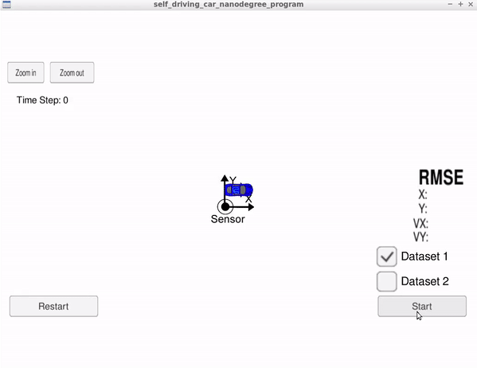
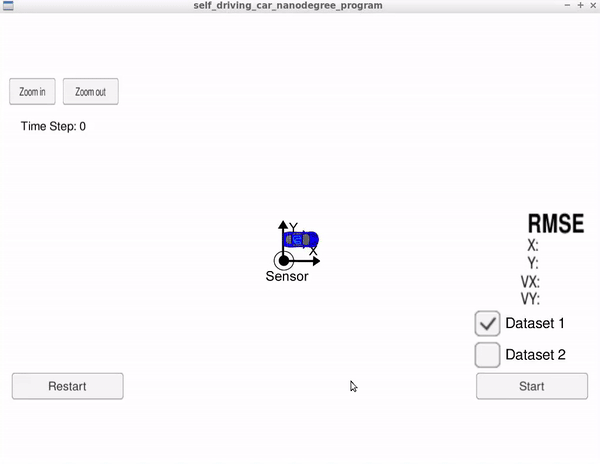

# Overview
This project utilize a extended Kalman filter (EKF) in C++ to track a bicycle that travels around the vehicle with noisy lidar and radar measurements.  Lidar measurements are red circles, radar measurements are blue circles with an arrow pointing in the direction of the observed angle, and estimation markers are green triangles. The estimates of the EKF are compared to the ground truth data. The performance of the filter is evaluated by Root Mean Squared Error(RMSE), px, py, vx, and vy RMSE should be less than or equal to the values [.11, .11, 0.52, 0.52].



## Basic Build Instructions

1. Clone this repo.
2. Make a build directory: `mkdir build && cd build`
3. Compile: `cmake .. && make` 
   * On windows, you may need to run: `cmake .. -G "Unix Makefiles" && make`
4. Run it: `./ExtendedKF `

# Implementing the Kalman Filter 
The directory structure of this repository is as follows:
```
root
|   build.sh
|   CMakeLists.txt
|   README.md
|
|___data
|   |   
|   |   obj_pose-laser-radar-synthetic-input.txt
|   
|   
|___src
    |   Eigen
    |   FusionEKF.cpp
    |   FusionEKF.h
    |   json.hpp
    |   kalman_filter.cpp
    |   kalman_filter.h
    |   main.cpp
    |   measurement_package.h
    |   tools.cpp
    |   tools.h
```
kalman_filter.cpp contains the actual Kalman filter equations which is divided into two main process: Preidct and Update steps. Each time a new measurement is made from a given sensor, FusionEKF.cpp modify the F and Q matrices prior to the prediction step based on the elapsed time between measurements. The Jacobian matrix is computed either for the lidar or radar sensor measurement and corresponding update function is called. Every time main.cpp calls fusionEKF.ProcessMeasurement(measurement_pack_list[k]), the code in FusionEKF.cpp will run. If this is the first measurement, the Kalman filter will try to initialize the object's location with the sensor measurement.
 
INPUT: values provided by the simulator to the c++ program
["sensor_measurement"] => the measurement that the simulator observed (either lidar or radar)

OUTPUT: values provided by the c++ program to the simulator
["estimate_x"] <= kalman filter estimated position x
["estimate_y"] <= kalman filter estimated position y
["rmse_x"]
["rmse_y"]
["rmse_vx"]
["rmse_vy"]

